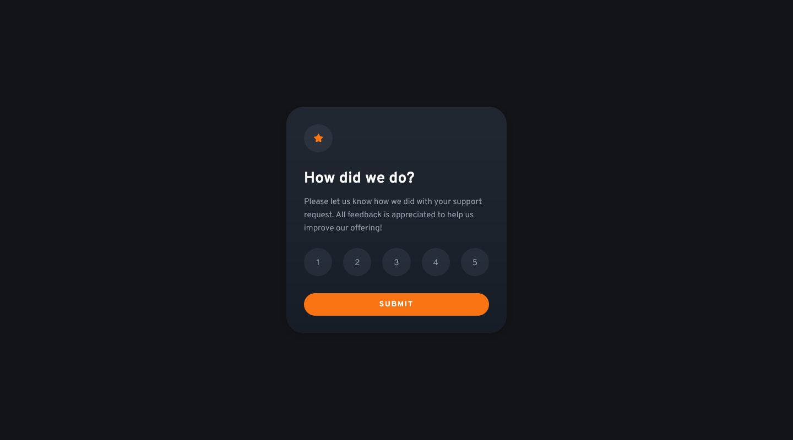

# Frontend Mentor - Interactive rating component solution

This is a solution to the [Interactive rating component challenge on Frontend Mentor](https://www.frontendmentor.io/challenges/interactive-rating-component-koxpeBUmI).

## Overview

### The challenge

Users should be able to:

- View the optimal layout for the app depending on their device's screen size
- See hover states for all interactive elements on the page
- Select and submit a number rating
- See the "Thank you" card state after submitting a rating

### Screenshot

### Links

- Solution URL: [GitHub repo](https://github.com/whiskydog/frontendmentor-interactive-rating/)
- Live Site URL: [GitHub pages site](https://whiskydog.github.io/frontendmentor-interactive-rating)

## Built with

- [React](https://reactjs.org/) - JS library
- Mobile-first workflow
- Flexbox

## Author

- Website - [Whiskydog GitHub Pages site](https://whiskydog.github.io)
- Frontend Mentor - [@Whiskydog](https://www.frontendmentor.io/profile/Whiskydog)
- Twitter - [@whiskydog](https://www.twitter.com/whiskydog)
